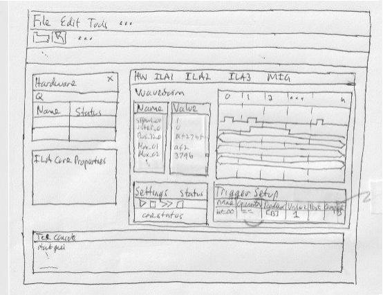

# Using (Xilinx) Vivado Integrated Logic Analyser (ILA)

The following are raw notes, from a software developer's perspective, on
using the Vivado tool to debug software that interacts with an
FPGA design.

An **Integrated Logic Analyzer** (ILA) is additional FPGA circuitry added
to a design.  A analogy is that an ILA acts as a better and more versatile
alternative to using an actual bus/signal analyzer device.  An ILA saves
the EE (or even perhaps a software developer) from having to connect
a bevy of wires from a bus analyzer device to signal points on a
circuit board (called the _bed of nails_ in the old days) or writing
custom JTAG queries to a chip.

The ILA allows examination (i.e. **probe**) of the behavior of an FPGA
circuit.  A software developer will be interested in the circuit behavior
in response to software commands written to registers.

The ILA is (likely) not included in the final FPGA product.  It is only
incorporated into the base FPGA circuitry and allows the developer to
observe circuit behavior, mostly to debug software, but one might even
uncover circuitry bugs.

## 1) Discussion

The FPGA engineer(s) design the base circuitry.  They call this the **IP**,
which means _Intellectual-Property_.  They also often refer to it as the
**Register Transfer Language** (RTL).  It's all evolutionary terminology
from the olden days when the first circuit designs were implemented using
**Verilog Hardware Definition Lanaguage** (VHDL), etc.  A lot has happened
in 50 years.

The following are the steps followed to activate an ILA and set triggers on
a Xilinx **VCU128 Evaluation Board**.  The base Xilinx FPGA chip is the
**Virtex UltraScale+ VU37P**.  The FPGA specifics are mostly over my head,
but the steps that follow are intended to be generic enough that a software
 developer can debug software that interacts with defined registers of the
 FPGA system.

Also, the specific case was that the FPGA system used/implemented a **AXI**
bus system.  The **Advanced eXtensible Interface** (AXI) is a bus protocol
that defines registers in an address space.  Software can read and write to
the FPGA registers simply by specifying their address.

An **AXI** bus is the Xilinx implementation of
the **Advanced Microcontroller Bus Architecture** (AMBA), a flexible bus
architecture defined by the group that defined the **ARM** processors.

It's a powerful bus architecture, but for me I see it as a "squishy"
version of a **VME** bus.  The VME (16-bit, 32-bit, 64-bit, etc) were
fixed size address and data bus.  Software could simply read/write to
any device's register interface by specifing an address.  It didn't
matter if the address was local to the processor or on another board
in the chassis.  But **AMBA** can have different sized address, control,
and data busses.  But from the software perspective, the read/write is
the same.  Just specify the correct address.  The implementation is left
to the FPGA designer to follow the **AMBA** protocol.  Or, in the case
of Xilinx, to follow the **AXI** protocol.  Even so, Xilinx offers different
versions of the **AXI** bus protocol (e.g. **AXI4**, **AXI-lite**, etc).
But for the most part, the protocol chosen by the FPGA designer doesn't
effect the read/write mechanism of the software.

Of course, **bare-metal** read/writes vs **device-driver** or 
even **kernel-code** operations do become the concern of the software
developer.

Maybe I should've mentioned this earlier, but register I/O via an **AXI**
interface is done by software the runs on an _instantiation_ of
a **Microblaze Processor** as part of the the FPGA circuitry.
The **Microblaze** is an evolutionary version of the rather old **RISC**
processor called the **DLX**.  The **DLX** was the _theoretical_ CPU
defined in the book _Computer Architecture: A Quantative Approach_ (by
J. Hennessy and D. Patterson).  I remember using this book in my
computer architecture class at **CSULB**, I think back in 1992.

Anyway, the **Microblaze** is an actual implementation of the **DLX**
processor, of course evolved to modern times.  The FPGA designer specifies
if the FPGA circuitry is to include a **Microblaze** CPU.

### 1.1) Serial Port and JTAG Connection

The **VCU128** evaluation board is nominally connected to a host workstation
(e.g. Windows or Linux) via a dual-line connection.  The first connection
contains the bundle for a **JTAG** connection.  The second is a **USB**/serial
line to the board.

1. JTAG

   Allows download/install of the FPGA-ware:
   ```
   .bit - The FPGA-ware, aka IP
   .xsa - Interface to allow load/start/run of ELF on processor
   .elf - Runtime executable image targeted to the (microblaze) processor
   ```

2. Serial port

   Allows IO between host workstation (running **Vivado**) and the instantiated
   CPU on the FPGA.
   
   Xilinx provides a rather rich set of board-support packages that can be
   used by software targeted to the **Microblaze** CPU.  This includes
   serial I/O packages.

## 2) Vivado Start

Start 'gnome-terminal'

Run following commands
```
   #!/bin/bash
   module use --append <path-to-Xilinx-installation>
   
   VDIR=<path-to-Xilinx-installation>
   VBIN=$VDIR/bin
   PATH=$PATH:$VBIN
   VEXE=$VBIN/vivado
   #possibly set TMPDIR if /tmp not available
   #export TMPDIR=$HOME/<work-area>
   source $VDIR/settings64.sh
   $VXE &
```
The **Vivado** tool starts and the base start-up window is shown.


If starting an ILA session for the first time, continue to Section **3**.

If hardware selection has been done previously, skip to Section **5**.

## 3) Setup - Open Hardware Manager
 
Follow steps shown here to open the **hardware manager**.


The steps show to _Open Hardware Manager_ and to display the initial dialog
window.

## 4) Select Target Hardware

The next diagram shows steps to open/activate a **hardware target**.

Follow the steps of the _open new hardware target_ **wizard**.


The **host** is local to your workstation **127.0.0.1**

The **port** always seems to be **3121**.

This will show the **Select Hardware Target** dialog


This shows the list of target boards that are currently connected to the
host workstation.

At this point, you need to know what the **serial number** to the board
to be used to testing.

Again, each board is connected to the host workstation via a
serial/JTAG line.

The documentation on when/how the board was connected to the host workstation
should include the **serial number** to each board.

Alternatively (i.e. no or poor documentation), on a **Linux** host the serial
number may be determined by using the following tools:
```
   #!/bin/bash
   DEVS=`ls -l /dev/ttyUSB* | sort -tB -k2 -g`
   for e in $DEVS; do
      udevadm info --query=property --name=$DEVS
   done
```
Note: Board information might be defined in a **JSON** file.  Thus:
```
   Use 'jq' tool to pares JSON file of information
```

Once the **serial number** to the specific board is elected, select the target
on the dialog.

The **wizard** will complete by showing a _splash_ window showing the
information about the selected board ... then a _working_ dialog.

When **wizard** completes, the ILA **probe** dialog/window will be shown.

## 5) Load Probe (ILA) File - <probe>.ltx

If the target board has been loaded during a previous session, then select:
```
   Open Recent
       |
       |---> Target
       
   Select the previous board configuration from the previous session
```
At this point, the **probe** window/dialog is shown.


A **probe file** is a list of signal points in the ILA circuitry, which
allows signals in the IP to be observed.  An EE would probably laugh,
but probe signals for a software developer are analogous to _break points_
in source code.

Probe files have the file extension **.ltx**.

From the **trigger setup** pane, select the:
```
      Specify the Probes File & refresh the dev
```
Follow the _File Open_ dialogs to select the **.ltx** file that maps to the
**ILA** that was incorporated into the FPGA-ware by the FPGA designer.

Once the **.ltx** file is selected, focus will return to the **probe**
window/dialog.

## 6) Select Trigger Signals

To specify the signal(s) to probe press the **+** sign at
the **Trigger Setup** pane.


This will show the **Add Probes** dialog.


This is a list of the signals from the **.ltx** file.  These signals can be
discrete lines or entire bus lines of the FPGA circuitry that can be observed
via the **ILA** circuitry.

Signals can be _observed_ or used to setup what are called **trigger**
conditions.  In this case, a **trigger** condition is when state of
as signal changes and this causes the ILA to measure the states of all
the other signals and busses.  For example, a **probe** signal called
_DataValid_ can be set to trigger the ILA when it goes _active high_.
 
When the trigger condition occurs the ILA will measure all the signals
defined in the probe file and display them on the GUI.

Select the signals that will be used to define **trigger** events from
the **Add Probes** dialog.

Focus will then return to the **probe** dialog/window.

**Side Bar** - At this point, go to the **Settings** pane and change
the **Trigger position in Window** parameter from 512 to, say, 100.  Otherwise,
when the _trigger_ event(s) occur the signal patterns shown in the **trace**
pane will be too dense to be useful.
```
   NOTE - once the value is changed to 100, click somewhere else
          on the dialog so the value gets latched into the window's
          settings.
```


Return to the **Trigger Setup** pane.  Select the different _columns_ to
define how/why the signal will trigger the **ILA**.  For example, if
a chosen signal is _DataValid_, then the **operator** can be logical
equal (**==**) the **radix** is TBD, the **value** is **logical 1**, etc.


At this point, the setup is ready to be _triggered_.  There are
several _play_ options.  In most cases, the single arrow
for _Run trigger for this ILA core_ is used.

i.e. press the single arrow button ...


The ILA is now waiting for the trigger condition to be met.  At this point
the software developer will (likely) run software that writes to one or
more FPGA registers that will cause the signal (e.g. _DataValid_ to
go _active high_.

Do so.  I.e. run your software at this point ...

When the signal goes high, the ILA will capture all the other signals and
bus values for the **100** clock cycles.

The capture is shown in the trace pane.  The name of each signal and bus
is shown with the value (either binary 1 or 0 or if a bus the hex values
that were transferred over the bus at each clock pulse).  The green trace
for each signal/bus is shown.



To repeat, press the single arrow button **>** to reset the ILA to be ready
for another capture ... perhaps caused by a read/write to a different
register.

```
   Other Notes:
      1) Use <ctrl>Mouse roll to zoom in or out of the (green) trace window

      2) The 'value' pane for each signal/bus can be expanded to the right
         to show more/all data ... and also decreased ... using pane
         border selection.

      3) The '>>' button can be used for

                        'Run trigger immediate for this ILA core'

                  This will show a 'steady state' of the signal. i.e. without
                  any specific trigger activating the signal capture.

      5) You can sort/re-order the signals in the "NAME" pane so that
         it might be easier to see/observe signals that are of more
         interest than others.

      6) You can watch what's happening at a finer grain via the
         Tcl Console window (at the bottom).  But much of this might
         be more useful to the FPGA designer and might be rather
         arcane to a software developer.
```

## 7) Shutdown

Show 'graceful' exit here.

Not sure if have to disconnect from hardware (via JTAG connection)
or just do "exit".

# NOTES/REFERENCES

1. Running **Vivado** may not render correctly on full 32-bit graphics
   environment.  Especially when running via Windows **mstsc** remote
   desktop tool:
```
       Some "colors" are rendered as "see through".

       I forget how, but there may be a start option on the
       "Windows to Linux" 'mstsc' tool to select a 24-bit color
       pallette.  Vivado will render correctly then.
```

2. How to Load/Install **FPGA** products to target board

   Tcl script to load/install FPGA-ware.

   Use the Xilinx tool **xsct** and specify the following Tcl script.

   ATTEN - This is for load/install to a **Virtex UltraScale+ VU37P** on
   a **VCU-128** Evaluation board.  The `xsct` will download the FPGA product(s)
   via the **JTAG** connection from the host workstation to the target
   board.

   The `xsct` tool has been _deprecated_ by Xilinx (AMD) for later
   products.  The **VCU-128** is no longer available from Xilinx.

   The syntax is:
```
      xsct load_board.tcl <xsa-file> <bit-file> <elf-file> <serial-num>
```

   where `xsct` is in **$PATH**.

   The following is the `load_board.tcl`:

```
   set XSA_FILE      [lindex $argv 0]
   set BIT_FILE      [lindex $argv 1]
   set ELF_FILE      [lindex $argv 2]
   set SERIAL_NUM    [lindex $argv 3]

   puts "--->    XSA File...: $XSA_FILE"
   puts "--->    BIT File...: $BIT_FILE"
   puts "--->    ELF File...: $ELF_FILE"
   puts "--->    Tgt ID.....: $SERIAL_NUM"
   
   connect -url tcp:127.0.0.1:3121
   
   puts "---> targets to load FPGA bit file"
   
   targets -set -filter {target_ctx =~ "*${SERIAL_NUM}*" && name =~ "xcvu37p"}
   
   puts "---> load bit file"
   
   loadhw -hw $XSA_FILE -regs
   
   puts "---> loadhw"
   
   loadhw -hw $XSA_FILE -regs
   
   puts "---> reset"
   
   rst -system
   
   puts "---> download elf"
   
   dow $ELF_FILE
   
   puts "---> con"
   
   con
   
   puts "---> done"
```

