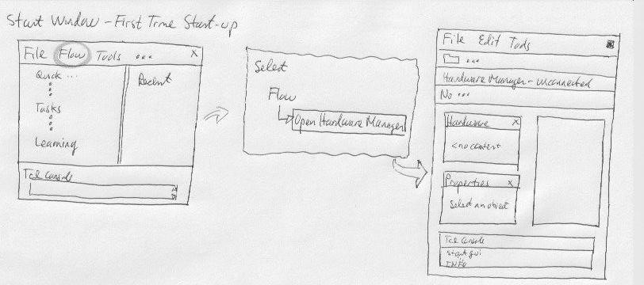
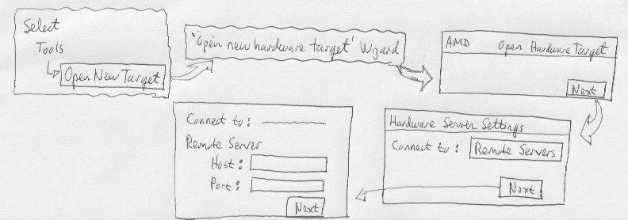
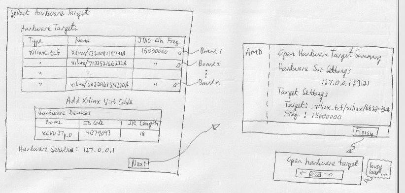
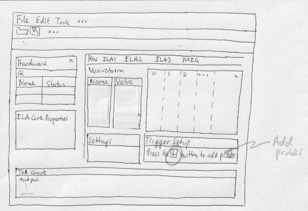
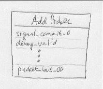
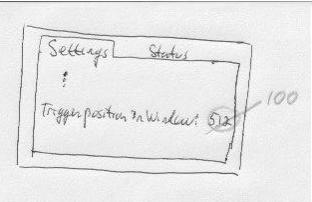

# Using (Xilinx) Vivado Integrated Logic Analyser (ILA)

The following are raw notes, from a software developer's perspective, on
using the Vivado tool to debug software that interacts with an
FPGA design.

An **Integrated Logic Analyzer** (ILA) is additional FPGA circuitry added
to a design.  The ILA allows examination (i.e. **probe**) of the behavior
of an FPGA circuit, usually in response to software commands written to
registers.  The ILA is (likely) not included in the final FPGA product.
It is only appended to the base FPGA circuitry and allows the developer to
observe/probe circuit behavior, mostly to debug software, but one might
even uncover circuitry bugs.

## 1) Discussion

The FPGA engineer(s) design the base circuitry.  They call this the **IP**,
which means _Intellectual-Property_.  They also often refer to it as the
**Register Transfer Language** (RTL).  It's all evolutionary terminology
from the olden days when the first circuit designs were implemented using
**Verilog Hardware Definition Lanaguage** (VHDL), etc.  A lot has happened
in 50 years.

The following are the steps followed to load an ILA and set triggers on
a Xilinx **VCU128 Evaluation Board**.  The base Xilinx FPGA chip is the
**Virtex UltraScale+ VU37P**.  Again, the FPGA specifics are likely
over my head, but the steps that follow are intended to be generic
enough that a software developer can debug software that interacts
with defined registers of the FPGA system.

Also, the specific case was that the FPGA system used/implemented a
**AXI** bus system.

Discuss here how the _brains_ at **ARM** came up with their Advanced
Modular Interface (or such) bus and then Xilinx adopted and came up with
**Advanced eXtensible Interface** (AXI) and also **AXI-lite**, a less
flexible but simpler (?) bus interface.

Then, discus here my "opinion" that AXI is a squishy VME interface that allows
software to write directly to registers via an address available to
the CPU bus. 

### 1.1) Serial Port and JTAG Connection

Describe here how a **VCU128** board has two connections:
1. JTAG

   Allows download/install of the FPGA-ware:
   ```
   .bit - The FPGA-ware, aka IP
   .xsa - Interface to allow load/start/run of ELF on processor
   .elf - Runtime executable image targeted to the processor
   ```

2. Serial port

   Allows IO between host workstation (running Vivado) and any instantiated
   CPU on the FPGA.  Likely CPU installation is the **Microblaze Processor**.

## 2) Vivado Start

Start 'gnome-terminal'

Run following commands
```
   copy script contents here
```


## 3) Setup - Open Hardware Manager



If starting an ILA session for the first time, continue to Section **3**.

If hardware selection has been done previously, skip Section 3 and
proceed to Section **4**.

## 4) Select Target Hardware

Diagram shows steps to open/activate a **hardware target**.

Follow the steps of the Vivado **wizard**.



The **host** is local to your workstation **127.0.0.1**

The **port** always seems to be **3121**.

Need to know what the **serial number** to the board.

Select the target based on the **serial number**.

## 5) Load Probe (ILA File - <probe>.ltx)

A **probe file** is a list of signal points in the ILA circuitry, which
allows signals in the IP to be observed.  An EE would probably laugh,
but probe signals for a software developer are analogous to _break points_
in source code.



Probe files have the file extension *.ltx*.

## 6) Trigger

Select signal(s) to probe ... called _trigger_ signals.

When the trigger condition occurs the ILA will measure all the signals
defined in the probe file and display them on the GUI.



Setup trigger events:


More



More



More


More

## 7) Shutdown

Show 'gracefull' exit here.

Not sure if have to disconnect from hardware (via JTAG connection)
or just do "exit".

# References

NOTE - Running Vivado may not render correctly on full 32-bit graphics
       environment.
````
       Some "colors" are rendered as "see through".

       I forget how, but there may be a start option on the
       "Windows to Linux" 'mstsc' tool to select a 24-bit color
       pallette.  Vivado will render correctly then.
```

