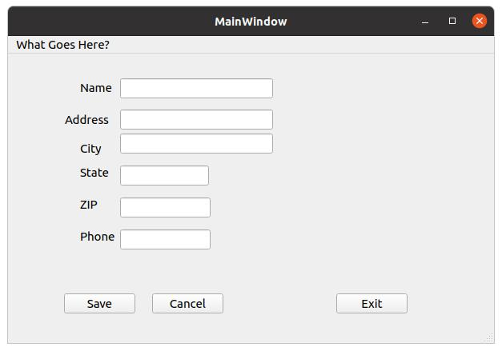

# Java Data Entry Demo

The goal here is to show how to define/implement a data-entry
GUI and then save the values to a file.

## Requirements

This is essentially a duplicate of the 'data-entry' demo
in the **Qt** area.  The following entries are to be processed:
```
   Name:
   Address:
   City:
   State:
   ZIP:

   Save Reset Exit
```

The **Java** application is to implement the following window, which
is what was previously implemented in **Qt** using the **qtcreator**
tool:



The following behavior is to be implemented:

   1. On selection of the **Save** button, the Java application
      will get (extract) each of the values (`Name`, `Age`', etc)
      and save them to a file called `data_entry.txt`.  The data
      will be saved as ASCII.

   2. On selection of the **Reset** button, each of the date-entry
      fields will be cleared.

   3. On selection of the **Exit** button, the application will
      simply exit.  Thus, data is only saved if the user presses
      the **Save** button.

The **crux** of the matter here is that the application will be
implemented entirely programmatically.  In other words, no GUI
tool is used, as was done for the **Qt** implementation.

Apparently, in reading the **Oracle** page [1], this is the hard
way to go about doing GUI work.

## Implemenation

The bulk of the functionality is implemented in a class called
`data_entry` (ref: `data_entry.java`).

The `main` is straight forward in that all it does is instantiate
a `data_entry` object.

### GUI Alignment

There are apparently several choices here:

   1. Painstakingly specify the (x,y) location of each GUI object,
      essentially by trial-and-error.

   2. Use the **Spring** class to align the objects.

      The `Spring` class implements a placement/rendering  mechanism
      that gives the GUI objects `spring like` behavior.  They
      align with each other as if **springs** were holding them
      in place ... such the name of the class **Spring**.

      The **Spring** class implements different types of alignment
      mechanisms, as described in [1].

      I started with the `base` mechanism, and this proved very
      difficult. 

   3. There are other `alignment` mechanisms offered via the Java
      **awt** library.  But I settled on `Spring`.  Maybe I did this
      because it reminded me of the `attachment` mechanism offered
      in the **X Window System** (namely the `Xt/Xm` libraries).  But
      choosing something because it's familiar may not always be
      prudent ... especially since the Java system is so big and
      offers so much more functionality than **X/Xt/Xm**.

The Oracle **Java** page [1] indicates that the `sane` (my words) way
to do GUI work is to use an IDE (`Integrated Development Environment`).
In particular they recommend **NETbeans**, and that will make all the
pain of **Spring** work go away.

A `google` query also suggests using **NETbeans** or **Eclipse**.  But
they highly recommend some thing I've never heard of called
**IntelliJ IDEA**.  It's `free` for a base version ... but costs
about $150 (or more for more features) for something like a 2 or 3
year license.  But apparently it is the most popular tool for Java
GUI development.

So I guess there's a bit of `cognitive dissonance` going on here.  While
I downloaded/installed the **qtcreator** tool for the **Qt** version of
the `data_entry` demo, I'm not doing so here.  I'm going to try to push
my through a programmatic implementation of the **Spring** mechanism
for the GUI alignment/presentation.


# REFERENCES

[1] https://docs.oracle.com/javase/tutorial/uiswing/layout/spring.html

